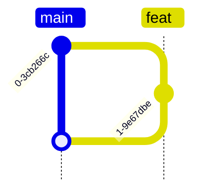

# Deployment

```mermaid
gitGraph TB:
    checkout main
    commit
    branch test order: 2
    branch prod order: 3
    branch feat
    commit
    checkout main
    merge feat
    checkout test
    merge main
    checkout prod
    merge test
    checkout test
    merge prod
    checkout main
    merge test
```

## Developing a Feature



## Promotion to Testing

```mermaid
gitGraph TB:
    commit
    branch test order: 2
    branch feat
    commit
    checkout main
    merge feat
    checkout test
    merge main
```

## Promotion to Production

```mermaid
gitGraph TB:
    checkout main
    commit
    branch test order: 2
    branch prod order: 3
    branch feat
    commit
    checkout main
    merge feat
    checkout test
    merge main
    checkout prod
    merge test
```

## Syncing Merge Commits

```mermaid
gitGraph TB:
    checkout main
    commit
    branch test order: 2
    branch prod order: 3
    branch feat
    commit
    checkout main
    merge feat
    checkout test
    merge main
    checkout prod
    merge test
    checkout test
    merge prod
    checkout main
    merge test
```
