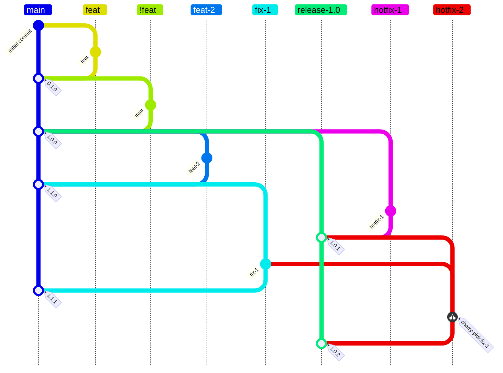

# Release

```mermaid
gitGraph TB:
    checkout main
    commit id: "initial commit"
    branch feat
    commit id: "feat"
    checkout main
    merge feat tag: "0.1.0"
    branch "!feat"
    commit id: "!feat"
    checkout main
    merge "!feat" tag: "1.0.0"
    branch release-1.0 order: 2
    branch feat-2
    commit id: "feat-2"
    checkout main
    merge "feat-2" tag: "1.1.0"
    checkout release-1.0
    branch hotfix-1 order: 3
    commit id: "hotfix-1"
    checkout release-1.0
    merge hotfix-1 tag: "1.0.1"
    checkout main
    branch fix-1
    commit id: "fix-1"
    checkout main
    merge fix-1 tag: "1.1.1"
    checkout release-1.0
    branch hotfix-2 order: 3
    cherry-pick id: "fix-1"
    checkout release-1.0
    merge hotfix-2 tag: "1.0.2"
```